# OpenSpec 项目逻辑分析与 Quest Spec 构建指南

## 文档目标

本文档深入分析 OpenSpec 项目的核心逻辑、架构设计和使用优势,为构建自己的 Quest Spec 提供战略指导和最佳实践。

## 一、OpenSpec 核心理念与价值主张

### 核心问题定位

OpenSpec 解决了 AI 编码助手时代的一个关键痛点:当需求仅存在于聊天历史中时,AI 输出不可预测且难以审核。通过引入轻量级的规范驱动开发流程,OpenSpec 在实现之前锁定意图,实现确定性和可审查的输出。

### 独特价值

**与传统方法的对比优势**

| 维度 | OpenSpec 优势 | 说明 |
|------|--------------|------|
| 轻量级 | 简单工作流、无需 API 密钥、最小化设置 | 降低采用门槛 |
| 棕地友好 | 支持 0→1 之外的场景 | 区别于 spec-kit 和 Kiro,特别擅长 1→n 修改 |
| 变更跟踪 | 提案、任务和规范增量集中管理 | 通过归档将批准的更新合并回规范 |
| 状态分离 | specs/ (当前真相) vs changes/ (提议更新) | 使差异明确且可管理 |
| 工具无关 | 支持多种 AI 工具和自定义命令 | 灵活适配团队现有工具链 |

### 设计哲学

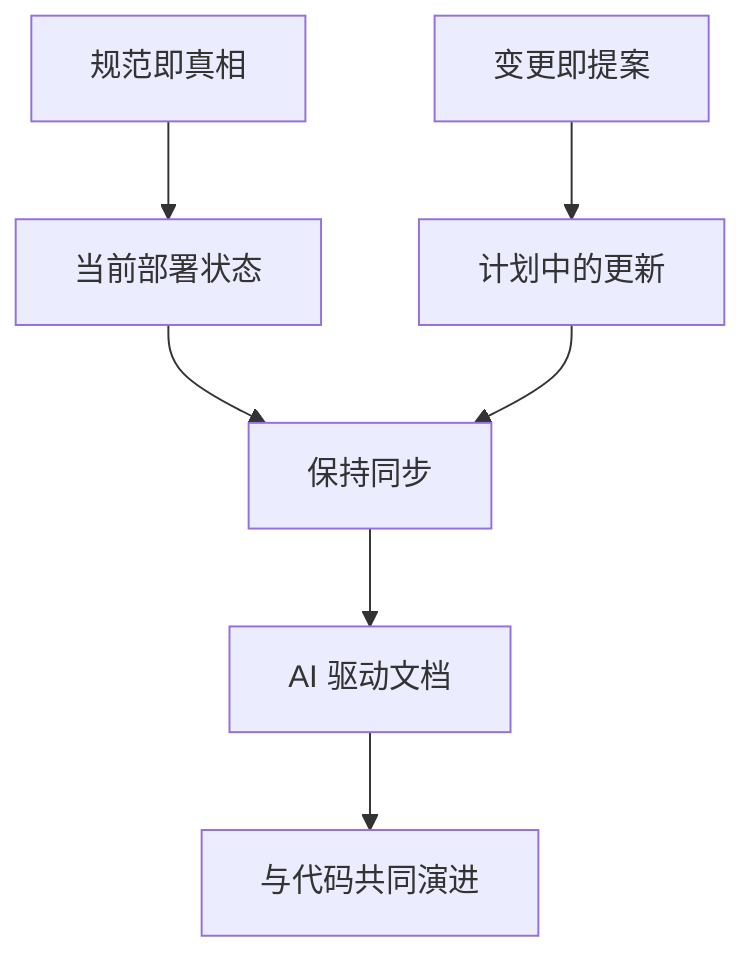

**核心原则**
- 规范反映当前已构建和部署的内容
- 变更包含对应该修改内容的提案
- AI 驱动文档过程
- 规范是与已部署代码保持同步的活文档

## 二、架构设计深度解析

### 2.1 目录结构战略

```
openspec/
├── project.md              # 项目级约定和上下文
├── AGENTS.md              # AI 助手统一入口指令
├── specs/                 # 真相源 - 当前已部署能力
│   └── [capability]/      
│       ├── spec.md        # 需求和场景(WHAT & WHY)
│       └── design.md      # 技术模式(HOW,可选)
└── changes/               # 提案 - 待变更内容
    ├── [change-name]/     
    │   ├── proposal.md    # 为什么、是什么、影响
    │   ├── tasks.md       # 实现清单
    │   ├── design.md      # 技术决策(可选)
    │   └── specs/         # Delta 变更
    │       └── [capability]/
    │           └── spec.md
    └── archive/           # 已完成变更
        └── YYYY-MM-DD-[name]/
```

**设计考量**

| 设计决策 | 理由 | 优势 |
|---------|------|------|
| 双文件夹模型 | 分离当前真相与提议变更 | 状态清晰,避免混淆 |
| 扁平化 capability | 单一职责,无嵌套 | 简化发现,降低复杂度 |
| 日期前缀归档 | 时间序列可追溯 | 便于审计和历史回溯 |
| 可选 design.md | 按需记录技术决策 | 避免过度设计,保持简洁 |

### 2.2 Delta 格式创新

OpenSpec 的 delta 格式是其核心创新之一,实现了结构化的变更追踪。

**Delta 操作类型**

```markdown
## ADDED Requirements
新增能力

## MODIFIED Requirements  
变更行为(包含完整更新后的需求)

## REMOVED Requirements
废弃功能

## RENAMED Requirements
名称变更
```

**关键机制**

| 机制 | 实现方式 | 价值 |
|------|---------|------|
| 基于标题的匹配 | 使用 `### Requirement: [Name]` 作为唯一标识符 | 程序化匹配,避免歧义 |
| 标准化规范化 | `normalize(header) = trim(header)` | 忽略空白,容错性强 |
| 完整需求替换 | MODIFIED 包含完整更新内容 | 避免部分更新导致信息丢失 |
| 跨节冲突检测 | 验证同一需求不在多个节中 | 保证数据一致性 |

**归档流程逻辑**

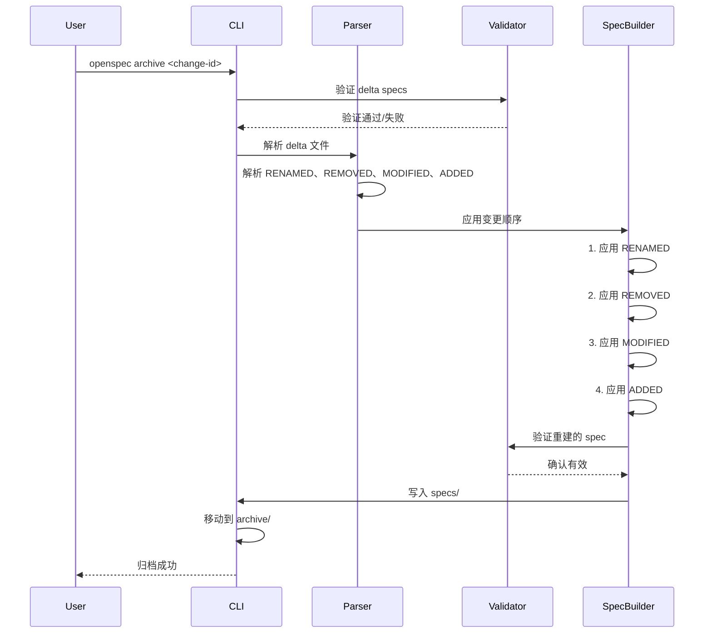

### 2.3 结构化规范格式

**层次化需求表达**

```markdown
### Requirement: [功能名称]
系统应当(SHALL/MUST)提供...

#### Scenario: [场景描述]
- **GIVEN** 初始状态(可选)
- **WHEN** 条件或触发器
- **THEN** 预期结果
- **AND** 额外结果或条件
```

**格式设计优势**

| 特性 | 设计选择 | 收益 |
|------|---------|------|
| 视觉一致性 | Requirement/Scenario 前缀 | 快速识别,提升可读性 |
| 可解析性 | 一致结构 | 支持工具和自动化 |
| 强制场景 | 每个需求至少一个场景 | 确保可验证性 |
| 规范化关键词 | SHALL/MUST | 明确规范性要求 |

## 三、技术实现要点

### 3.1 核心模块职责

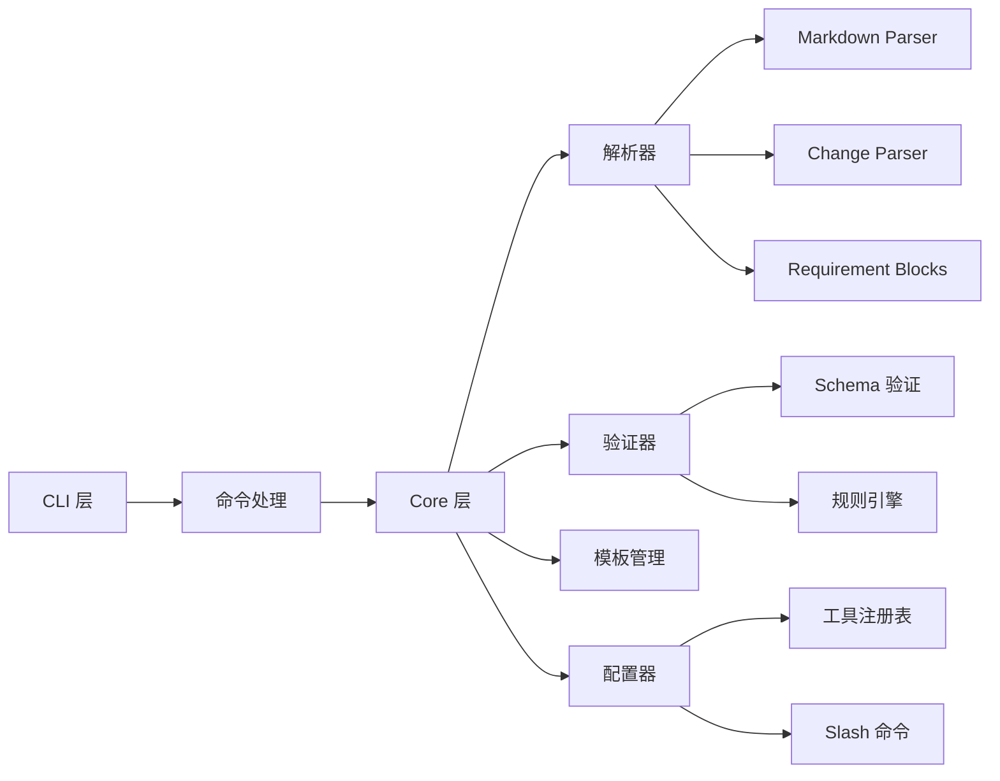

**模块划分策略**

| 模块 | 职责 | 关键设计 |
|------|------|---------|
| CLI | 用户交互、命令路由 | Commander.js,最小依赖 |
| Parsers | Markdown 解析、Delta 提取 | 正则匹配,状态机解析 |
| Validators | Schema 验证、规则检查 | Zod schema,可扩展规则 |
| Configurators | AI 工具集成、命令生成 | 注册表模式,插件化 |
| Templates | 文件脚手架、内容生成 | 函数式模板,上下文注入 |

### 3.2 关键算法解析

**Delta 解析算法**

从 `parsers/requirement-blocks.ts` 中提炼的核心逻辑:

**步骤流程**
1. **识别 Delta 节** - 扫描 `## ADDED|MODIFIED|REMOVED|RENAMED Requirements`
2. **提取需求块** - 按 `### Requirement:` 分割
3. **场景解析** - 识别 `#### Scenario:` 及其内容
4. **标准化匹配** - 规范化标题用于比对

**归档重建算法**

从 `archive.ts` 的 `buildUpdatedSpec` 方法:

**操作顺序至关重要**
```
RENAMED → REMOVED → MODIFIED → ADDED
```

**理由**
- RENAMED 先执行,确保后续操作引用新名称
- REMOVED 在 MODIFIED 前执行,避免修改不存在的需求
- MODIFIED 使用重命名后的标题
- ADDED 最后执行,避免与现有需求冲突

**冲突检测矩阵**

| 组合 | 检测逻辑 | 错误消息 |
|------|---------|---------|
| MODIFIED ∩ REMOVED | 同一标准化名称 | "在 MODIFIED 和 REMOVED 中都存在" |
| MODIFIED ∩ ADDED | 同一标准化名称 | "在 MODIFIED 和 ADDED 中都存在" |
| ADDED ∩ REMOVED | 同一标准化名称 | "在 ADDED 和 REMOVED 中都存在" |
| RENAMED TO ∩ ADDED | TO 名称冲突 | "RENAMED TO 与 ADDED 冲突" |
| MODIFIED ∩ RENAMED FROM | 引用旧名称 | "MODIFIED 必须引用新标题" |

### 3.3 验证机制

**多层验证策略**

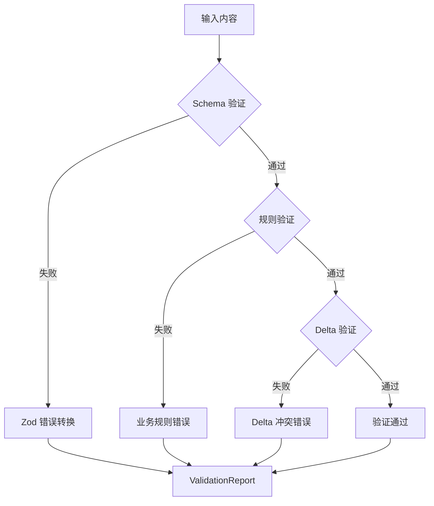

**验证层次**

| 层级 | 验证器 | 检查项 |
|------|--------|--------|
| 结构层 | Zod Schema | 必需字段、数据类型、基本格式 |
| 语义层 | 规则引擎 | Purpose 长度、场景存在性、SHALL/MUST |
| Delta 层 | Delta 验证器 | 重复检测、跨节冲突、至少一个 delta |
| 重建层 | 内容验证器 | 重建 spec 的完整性验证 |

**Strict 模式区别**

| 模式 | 错误阻断 | 警告阻断 | 适用场景 |
|------|---------|---------|---------|
| 普通模式 | ✓ | ✗ | 日常开发 |
| Strict 模式 | ✓ | ✓ | CI/CD、归档前 |

## 四、工作流程机制

### 4.1 三阶段生命周期

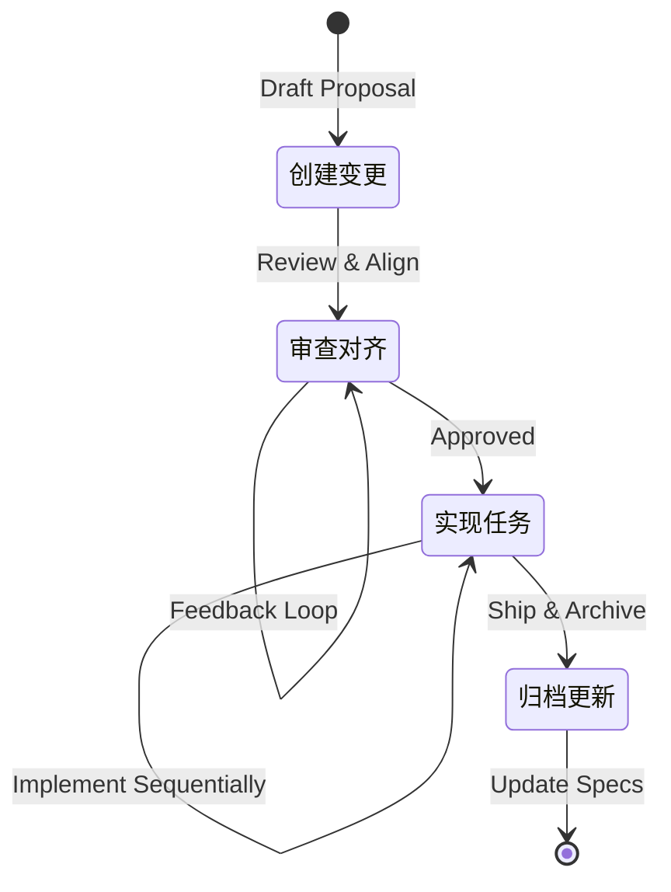

**阶段 1: 创建变更**

**触发条件**
- 新功能或能力
- 破坏性变更
- 架构或模式变更
- 影响行为的性能优化
- 影响访问模式的安全更新

**跳过条件**
- 恢复预期行为的 bug 修复
- 拼写或格式修复
- 非破坏性依赖更新
- 为现有行为添加测试
- 文档澄清

**工作流**
1. 审查 `openspec/project.md`、`openspec list`、`openspec list --specs`
2. 选择唯一的动词引导 `change-id`
3. 脚手架 `proposal.md`、`tasks.md`、可选 `design.md`、delta specs
4. 起草使用 `## ADDED|MODIFIED|REMOVED` 的 spec deltas
5. 运行 `openspec validate <id> --strict` 并解决问题

**阶段 2: 实现任务**

**顺序执行原则**
1. 读取 proposal.md - 理解构建内容
2. 读取 design.md(如果存在) - 审查技术决策
3. 读取 tasks.md - 获取实现清单
4. 顺序实现任务
5. 确认完成 - 所有项目在 `tasks.md` 中完成
6. 更新清单 - 将每个任务设置为 `- [x]`
7. 批准门 - 提案审查并批准后才开始实现

**阶段 3: 归档变更**

**归档前检查**
- 任务完成状态(可继续但有警告)
- Delta 验证(错误阻断)
- 重建 spec 验证(错误阻断)

**归档操作**
1. 将 `changes/[name]/` 移至 `changes/archive/YYYY-MM-DD-[name]/`
2. 更新 `specs/`(如果能力变更)
3. 对仅工具变更使用 `--skip-specs`
4. 运行 `openspec validate --strict` 确认

### 4.2 AI 工具集成策略

**多层集成架构**

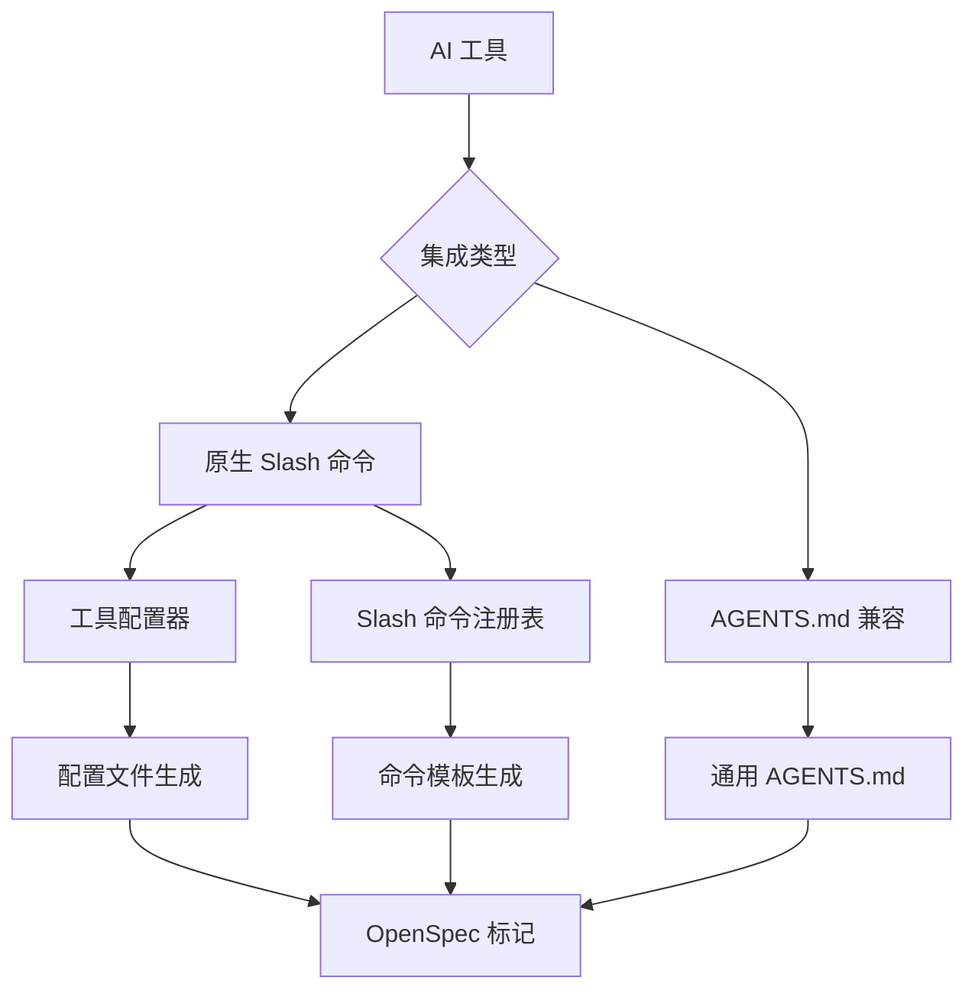

**配置器注册表模式**

从 `core/configurators/registry.ts` 和 `slash/registry.ts`:

**设计优势**
- **插件化** - 新工具通过注册表添加,无需修改核心
- **统一接口** - 所有配置器实现 `configure()` 方法
- **可用性检测** - 运行时检测工具是否可用
- **标记系统** - 使用 `OPENSPEC_MARKERS` 标识管理的文件

**Marker 机制**

```typescript
OPENSPEC_MARKERS = {
  start: '<!-- OPENSPEC_MANAGED_START -->',
  end: '<!-- OPENSPEC_MANAGED_END -->'
}
```

**用途**
- 标识 OpenSpec 管理的内容
- 支持增量更新(仅更新标记区域)
- 检测工具是否已配置

## 五、使用优势总结

### 5.1 对开发团队的价值

**确定性输出**

| 传统 AI 协作 | OpenSpec 方式 |
|-------------|--------------|
| 提示词驱动 → 不可预测输出 | 规范驱动 → 确定性实现 |
| 需求在聊天历史中丢失 | 需求结构化存储在 specs/ |
| 难以审查 AI 变更 | 明确的 delta diff |
| 重复工作 | 可复用的规范库 |

**可审计性**

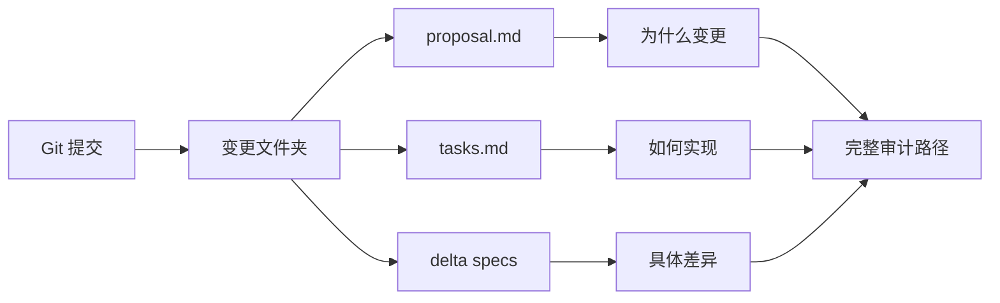

**团队协作**

- **工具灵活性** - 不同成员可使用不同 AI 工具(Claude Code、Cursor、Qoder 等)
- **共享真相源** - 统一的 specs/ 目录
- **变更可见性** - `openspec list` 查看所有进行中的工作
- **冲突检测** - 早期发现重叠规范

### 5.2 对 AI 助手的价值

**结构化上下文**

| 上下文类型 | 文件位置 | AI 获益 |
|-----------|---------|---------|
| 项目约定 | openspec/project.md | 了解技术栈、规范 |
| 能力清单 | openspec/specs/ | 发现现有功能 |
| 进行中工作 | openspec/changes/ | 避免冲突 |
| 工作流指令 | openspec/AGENTS.md | 统一流程 |

**可验证性**

- `openspec validate` 提供即时反馈
- Strict 模式确保高质量
- 自动化 delta 检测
- 场景强制确保可测试性

### 5.3 与其他方案对比

**vs. spec-kit**

| 维度 | OpenSpec | spec-kit |
|------|----------|----------|
| 状态管理 | 双文件夹(当前/提议分离) | 单一规范目录 |
| 变更追踪 | Delta 格式,集中式变更文件夹 | 分散在规范中 |
| 跨规范变更 | 单一变更文件夹可影响多个 spec | 较难追踪 |
| 适用场景 | 0→1 和 1→n 都擅长 | 主要针对 0→1 |

**vs. Kiro.dev**

| 维度 | OpenSpec | Kiro.dev |
|------|----------|----------|
| 变更组织 | `changes/feature-name/` 集中所有相关 | 更新分散在多个规范文件夹 |
| 功能追踪 | 单一文件夹包含规范、任务、设计 | 需要跨文件夹追踪 |
| 归档流程 | 自动应用 delta 到 specs/ | 手动合并 |

**vs. 无规范**

| 维度 | 无规范 | OpenSpec |
|------|-------|----------|
| AI 理解 | 依赖模糊提示 | 结构化需求 |
| 需求漂移 | 常见 | 通过审查阶段预防 |
| 文档 | 滞后或缺失 | 与代码共同演进 |
| 可预测性 | 低 | 高 |

## 六、构建自己的 Quest Spec 战略指南

### 6.1 设计原则借鉴

**从 OpenSpec 学到的关键原则**

**原则 1: 状态分离**

```
当前真相 ≠ 提议变更
```

**应用到 Quest Spec**
- 创建 `quests/active/` 和 `quests/completed/`
- 或 `quests/current/` 和 `quests/backlog/`
- 清晰的状态转换流程

**原则 2: Delta 驱动**

```
完整内容 vs 增量变更
```

**应用到 Quest Spec**
- 定义 quest 变更的 delta 格式
- 例如: ADDED_OBJECTIVES, MODIFIED_CRITERIA, REMOVED_DEPENDENCIES
- 支持 quest 的演进而不丢失历史

**原则 3: 结构化约束**

```
自由格式 < 结构化格式 < 过度结构化
```

**应用到 Quest Spec**
- 找到适合 quest 的平衡点
- 必需字段: 目标、验收标准、依赖
- 可选字段: 设计、技术笔记
- 使用 schema 验证但保持灵活

**原则 4: 工具无关**

```
核心逻辑 ≠ 工具集成
```

**应用到 Quest Spec**
- 核心 quest 格式是 Markdown
- AI 工具集成是可选层
- 支持多种项目管理工具

### 6.2 Quest Spec 核心结构建议

**基础目录结构**

```
quest-spec/
├── project.md              # 项目上下文
├── quests/
│   ├── active/            # 进行中的任务
│   │   └── [quest-id]/
│   │       ├── quest.md   # Quest 定义
│   │       ├── plan.md    # 实施计划
│   │       └── progress.md # 进度追踪
│   ├── completed/         # 已完成任务
│   └── templates/         # Quest 模板
└── workflows/             # 工作流定义
```

**Quest 文件格式**

```markdown
# Quest: [任务名称]

## Objective
[清晰的任务目标,类似 OpenSpec 的 Purpose]

## Success Criteria
### Criterion: [验收标准 1]
任务应当(MUST)达到...

#### Validation: [验证方式]
- **GIVEN** 初始条件
- **WHEN** 执行操作
- **THEN** 预期结果

## Dependencies
- Quest: [依赖的其他任务]
- Resource: [需要的资源]

## Implementation Plan
## 1. [阶段名称]
- [ ] 1.1 [具体步骤]
- [ ] 1.2 [具体步骤]

## Metadata
- **ID**: quest-001
- **Priority**: High|Medium|Low
- **Assigned**: [负责人]
- **Estimated**: [预估时间]
```

### 6.3 关键机制设计

**1. Quest 状态机**

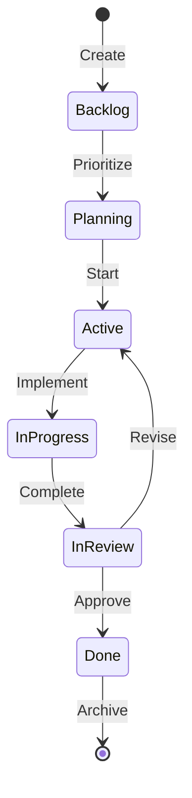

**2. Delta 追踪机制**

| 操作类型 | 用途 | 示例 |
|---------|------|------|
| UPDATED_OBJECTIVE | 目标调整 | 范围变更 |
| ADDED_CRITERION | 新增验收标准 | 发现新需求 |
| MODIFIED_PLAN | 计划调整 | 实施策略变化 |
| REMOVED_DEPENDENCY | 移除依赖 | 解耦 |

**3. 验证框架**

**Schema 定义(类比 OpenSpec)**

```typescript
const QuestSchema = z.object({
  id: z.string(),
  objective: z.string().min(20),
  successCriteria: z.array(CriterionSchema).min(1),
  dependencies: z.array(DependencySchema),
  plan: z.array(PhaseSchema).min(1),
  metadata: MetadataSchema
});
```

**验证规则**

| 规则 | 级别 | 检查项 |
|------|------|--------|
| 目标明确性 | ERROR | objective 至少 20 字符 |
| 验收标准存在 | ERROR | 至少一个 Criterion |
| 计划完整性 | WARNING | 每个阶段至少一个步骤 |
| 依赖有效性 | ERROR | 依赖的 quest 存在 |

### 6.4 工作流集成

**CLI 命令设计**

```bash
# 基础命令(借鉴 OpenSpec)
questspec init                    # 初始化
questspec create <quest-id>       # 创建新 quest
questspec show <quest-id>         # 显示 quest 详情
questspec validate <quest-id>     # 验证 quest
questspec progress <quest-id>     # 更新进度
questspec complete <quest-id>     # 标记完成
questspec archive <quest-id>      # 归档

# 高级命令
questspec list --status active    # 按状态列出
questspec dependencies <quest-id> # 显示依赖树
questspec timeline                # 显示时间线
```

**AI 助手集成**

类似 OpenSpec 的 AGENTS.md:

```markdown
# Quest Spec Instructions for AI Assistants

## Workflow

### Creating a Quest
1. Check existing quests: `questspec list`
2. Choose unique quest-id: kebab-case, verb-led
3. Draft quest.md with objective, criteria, plan
4. Validate: `questspec validate <quest-id> --strict`

### Implementing a Quest
1. Read quest.md - understand objective
2. Read plan.md - get implementation steps
3. Update progress.md as you complete steps
4. Mark criteria as validated when met

### Completing a Quest
1. Ensure all criteria validated
2. Run `questspec complete <quest-id>`
3. Archive to completed/
```

### 6.5 扩展方向

**高级特性(学习 OpenSpec 架构)**

| 特性 | 设计 | 收益 |
|------|------|------|
| Quest 模板 | 预定义不同类型的 quest 模板 | 加速创建,保证一致性 |
| 依赖图可视化 | 生成 Mermaid 图表 | 直观理解任务关系 |
| 进度仪表板 | 类似 `openspec view` | 团队透明度 |
| 变更提案 | Quest 修改需要提案审批 | 控制范围蔓延 |
| 历史追溯 | 归档保留完整历史 | 经验总结,模式识别 |

**集成生态(模仿 OpenSpec 工具支持)**

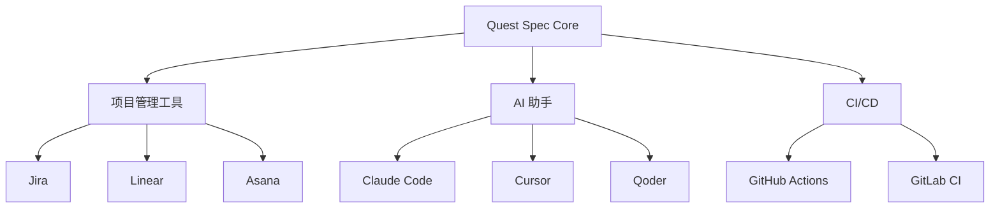

### 6.6 实施路线图

**阶段 1: MVP(最小可行产品)**

**核心功能**
- 基础目录结构
- quest.md 格式定义
- 简单的 CLI (create, show, validate)
- 基础 schema 验证

**里程碑**
- 能够创建和查看 quest
- 验证基本格式
- 手动状态管理

**阶段 2: 增强验证**

**新增功能**
- 完整的 Zod schema
- 规则引擎(类似 OpenSpec validator)
- Strict 模式
- 依赖验证

**里程碑**
- 捕获常见错误
- 提供有用的错误消息
- 确保 quest 质量

**阶段 3: 工作流自动化**

**新增功能**
- 状态转换自动化
- 进度追踪
- 归档流程
- 模板系统

**里程碑**
- 减少手动操作
- 标准化流程
- 可重复使用模式

**阶段 4: AI 集成**

**新增功能**
- AGENTS.md 生成
- Slash 命令支持
- 配置器注册表
- 多工具支持

**里程碑**
- AI 助手可自动创建 quest
- 工具无关的集成
- 团队协作支持

## 七、关键设计决策清单

构建 Quest Spec 时需要明确的决策点(基于 OpenSpec 经验):

### 决策 1: 状态模型

**选项**
- A) 文件夹分离(active/ vs completed/)
- B) 状态字段(metadata 中的 status)
- C) 混合(文件夹 + 字段)

**OpenSpec 选择**: A(changes/ vs archive/)
**建议**: 视团队规模和工具选择

### 决策 2: 变更追踪

**选项**
- A) Delta 格式(ADDED/MODIFIED/REMOVED)
- B) 完整历史(Git-like commits)
- C) 版本化(v1, v2, v3)

**OpenSpec 选择**: A
**建议**: 如果 quest 频繁变化,选 A;如果稳定,选 C

### 决策 3: 验证严格度

**选项**
- A) 宽松(只验证关键字段)
- B) 严格(类似 OpenSpec strict mode)
- C) 可配置(普通/strict 双模式)

**OpenSpec 选择**: C
**建议**: 早期选 A,成熟后升级到 C

### 决策 4: 工具集成深度

**选项**
- A) 核心独立(Markdown only)
- B) 浅集成(AGENTS.md)
- C) 深集成(多工具配置器)

**OpenSpec 选择**: C
**建议**: 从 A 开始,逐步发展到 C

### 决策 5: 复杂度管理

**选项**
- A) 单一 quest 文件
- B) 多文件(quest.md, plan.md, progress.md)
- C) 嵌套结构(sub-quests)

**OpenSpec 选择**: B(proposal.md, tasks.md, design.md, specs/)
**建议**: 根据 quest 复杂度选择

## 八、实战建议

### 8.1 从简单开始

**最小起步**

```markdown
# 第一个 Quest
1. 创建 quests/active/ 目录
2. 定义一个简单的 quest.md 模板
3. 手动管理(无 CLI)
4. 验证格式可行性
```

**渐进增强**

| 阶段 | 增加内容 | 时机 |
|------|---------|------|
| 1 | 基础结构 | 立即 |
| 2 | 简单 CLI | 有 5+ quests 时 |
| 3 | 验证器 | 发现格式错误时 |
| 4 | AI 集成 | 团队使用 AI 助手时 |

### 8.2 避免过度设计

**OpenSpec 的教训**

- **保持简单** - 默认少于 100 行新代码
- **单文件实现** - 直到证明不够用
- **避免框架** - 除非有明确理由
- **选择无聊的模式** - 已验证的方案

**复杂度触发器**

| 触发条件 | 允许的复杂度 |
|---------|-------------|
| 性能数据显示太慢 | 优化算法 |
| 具体规模需求(>1000 quests) | 引入索引/缓存 |
| 多个已验证用例需要抽象 | 添加抽象层 |

### 8.3 测试策略

**借鉴 OpenSpec 测试方法**

| 测试类型 | 覆盖范围 | 示例 |
|---------|---------|------|
| 单元测试 | 核心解析逻辑 | quest.md 解析器 |
| 集成测试 | 端到端流程 | create → validate → complete |
| 烟雾测试 | 关键路径 | CLI 命令可执行 |

**从 OpenSpec 学到的经验**
- 早期不需要 100% 覆盖
- 聚焦关键路径
- 手动测试直到复杂度增加
- 测试命令: `questspec validate --self` (类似 OpenSpec)

## 九、成功指标

### 定义成功的 Quest Spec

**功能指标**

| 指标 | 目标 | 测量方法 |
|------|------|---------|
| Quest 创建时间 | < 5 分钟 | 从想法到有效 quest.md |
| 验证准确性 | > 95% | 捕获的错误 / 总错误 |
| 状态转换流畅度 | 0 手动步骤 | CLI 自动化程度 |
| AI 理解率 | > 90% | AI 正确解释 quest 的比例 |

**质量指标**

| 指标 | 目标 | 测量方法 |
|------|------|---------|
| Quest 明确性 | 无歧义 | 团队成员理解一致性 |
| 可追溯性 | 100% | 从 quest 到实现的链接 |
| 文档时效性 | 实时 | Quest 与实际进度的滞后时间 |

**采用指标**

| 指标 | 目标 | 测量方法 |
|------|------|---------|
| 团队使用率 | > 80% | 使用 Quest Spec 的人数 |
| Quest 覆盖率 | > 90% | 被 Quest Spec 追踪的任务比例 |
| 工具满意度 | > 4/5 | 用户反馈评分 |

## 十、总结与行动清单

### OpenSpec 的核心智慧

**三大支柱**
1. **状态分离** - 当前真相与提议变更明确区分
2. **Delta 驱动** - 结构化变更追踪,可编程应用
3. **AI 友好** - 结构化约束 + 工具无关集成

**五个关键机制**
1. 双文件夹模型(specs/ vs changes/)
2. 基于标题的需求匹配
3. 有序 delta 应用(RENAMED → REMOVED → MODIFIED → ADDED)
4. 多层验证(Schema → 规则 → Delta → 重建)
5. 注册表模式的工具集成

### 构建 Quest Spec 行动清单

**立即行动(第 1 周)**
- [ ] 设计基础目录结构
- [ ] 定义 quest.md 格式
- [ ] 创建 3 个真实 quest 测试格式
- [ ] 收集团队反馈

**短期目标(第 1 个月)**
- [ ] 实现基础 CLI(create, show, validate)
- [ ] 定义 Zod schema
- [ ] 编写验证规则
- [ ] 文档化工作流

**中期目标(第 3 个月)**
- [ ] 实现完整状态机
- [ ] 集成 AI 助手(AGENTS.md)
- [ ] 构建进度仪表板
- [ ] 团队培训和推广

**长期愿景(第 6 个月)**
- [ ] 多工具集成(类似 OpenSpec 配置器)
- [ ] 高级分析(依赖图、时间线)
- [ ] 模板库
- [ ] 社区共享机制

### 最后的建议

**学习 OpenSpec 的方式**
1. **阅读代码** - 特别是 parsers/ 和 validation/
2. **运行命令** - 体验完整工作流
3. **检查测试** - 理解边界情况
4. **分析变更历史** - 看项目如何演进

**构建 Quest Spec 的心态**
- **从简单开始** - 不要一次实现所有功能
- **保持灵活** - 允许格式随需求演进
- **优先价值** - 聚焦解决实际问题
- **拥抱反馈** - 与团队迭代改进

**核心问题回答**

| 问题 | 答案 |
|------|------|
| Quest Spec 应该多复杂? | 足以清晰表达任务,但不过度结构化 |
| 需要支持哪些工具? | 从 Markdown + Git 开始,逐步集成 AI |
| 验证应该多严格? | 早期宽松,成熟后提供 strict 模式 |
| 如何确保采用? | 降低创建成本,提高价值可见性 |

### 结语

OpenSpec 提供了一个卓越的参考架构,展示了如何构建结构化、可验证、AI 友好的规范系统。通过借鉴其核心设计原则——状态分离、Delta 驱动、结构化约束、工具无关集成——你可以构建一个强大的 Quest Spec 系统,支持你的团队高效协作和 AI 辅助开发。

记住:最好的系统是被实际使用的系统。从简单开始,持续迭代,始终聚焦于为团队创造价值。

---

## 十一、从 SOP 到 Agentic:智能体化演进方案

### 11.1 当前 OpenSpec 的 SOP 特征分析

**固定流程的局限性**

当前 OpenSpec 主要依赖预定义的标准操作流程:

| SOP 特征 | 当前实现 | 局限性 |
|---------|---------|--------|
| 固定三阶段 | 创建→实现→归档 | 无法适应动态需求变化 |
| 严格格式要求 | proposal.md、tasks.md、delta specs | 缺乏上下文感知的灵活性 |
| 人工决策依赖 | 需要人工判断何时创建提案 | AI 无法自主决策 |
| 单向工作流 | 线性流程,回退需人工干预 | 无法自适应调整 |
| 静态验证规则 | 预定义 schema 和规则 | 无法学习和优化 |

**Agentic 系统的核心特征**

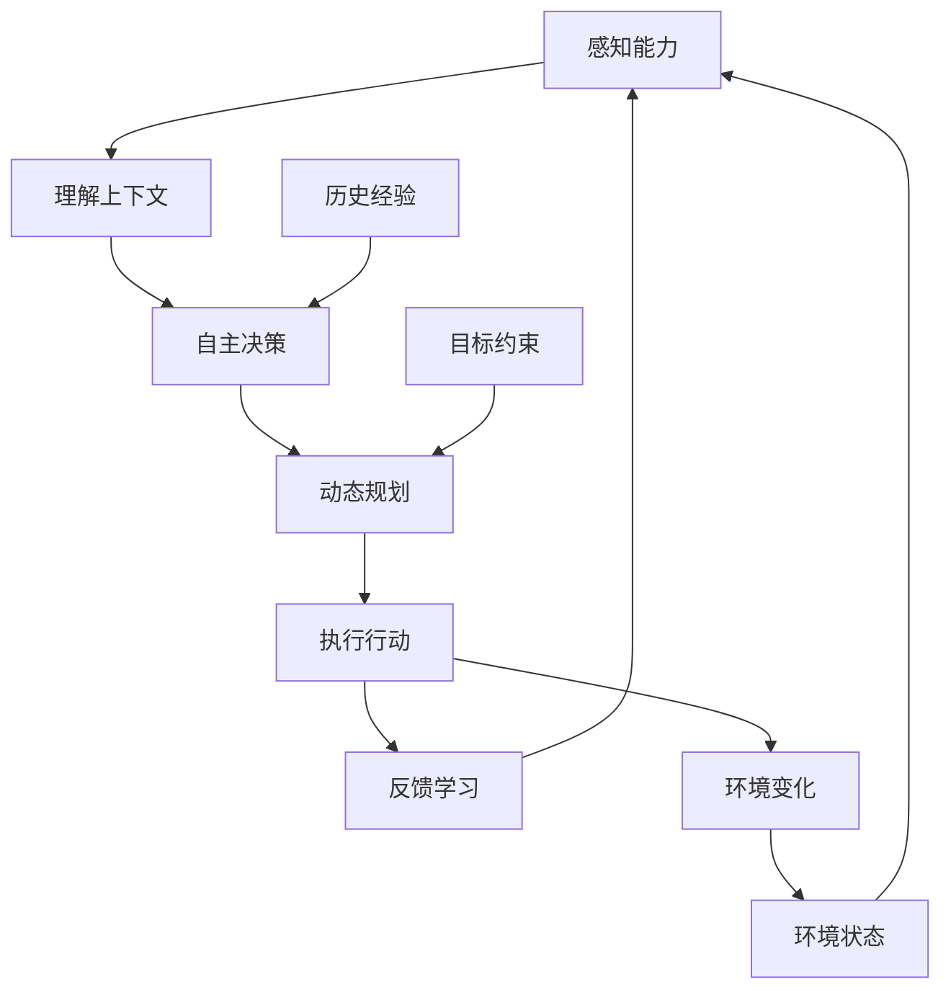

**Agentic vs SOP 对比**

| 维度 | SOP 模式 | Agentic 模式 |
|------|---------|-------------|
| 决策机制 | 预定义规则 | 基于上下文的推理 |
| 工作流 | 固定流程 | 动态生成计划 |
| 适应性 | 静态配置 | 自我调整 |
| 学习能力 | 无 | 从历史中学习 |
| 错误处理 | 报错退出 | 自主恢复或重新规划 |
| 目标导向 | 执行步骤 | 达成目标 |

### 11.2 Agentic OpenSpec 架构设计

**核心智能体架构**

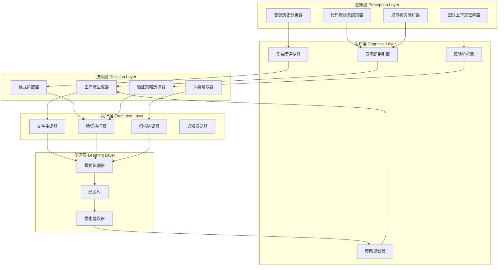

### 11.3 关键智能体能力设计

**能力 1: 上下文感知的意图识别**

**当前 SOP**
```
User: "添加用户认证"
→ 系统提示: 请运行 openspec create add-user-auth
→ 用户手动填写 proposal.md、tasks.md
```

**Agentic 方式**
```
User: "添加用户认证"

[感知阶段]
→ Agent 扫描 specs/ 发现已有 auth/ 目录
→ Agent 分析代码库发现现有登录逻辑
→ Agent 检查 changes/ 发现无冲突变更

[认知阶段]
→ 识别意图: 这是扩展现有能力,而非新建能力
→ 评估复杂度: 中等(需要修改现有 spec + 新增场景)
→ 识别影响范围: auth spec + user-service 代码

[决策阶段]
→ 生成定制化工作流:
  1. 修改 changes/enhance-auth/specs/auth/spec.md
     使用 MODIFIED + ADDED 混合
  2. 自动生成相关 tasks.md(基于代码分析)
  3. 建议可选 design.md(检测到架构影响)

[执行阶段]
→ 自动创建文件结构
→ 预填充基于代码分析的内容
→ 提供上下文化的模板
```

**实现机制**

| 组件 | 技术方案 | 数据源 |
|------|---------|--------|
| 意图分类器 | LLM prompt + few-shot examples | 用户输入 + 历史 changes |
| 代码库理解 | AST 分析 + 依赖图 | 源代码文件 |
| 规范理解 | Markdown 解析 + 语义向量 | specs/ 和 changes/ |
| 复杂度估算 | 规则引擎 + ML 模型 | 历史变更数据 |

**能力 2: 动态工作流生成**

**决策树引擎**

```typescript
interface WorkflowDecision {
  context: {
    intentType: 'new_capability' | 'enhance' | 'fix' | 'refactor';
    complexity: 'simple' | 'medium' | 'complex';
    impactScope: string[];  // 影响的 specs
    riskLevel: 'low' | 'medium' | 'high';
    teamContext: {
      hasActiveChanges: boolean;
      recentPatterns: string[];
    };
  };
  
  decision: {
    workflow: WorkflowStep[];
    requiredFiles: FileTemplate[];
    validationStrategy: 'relaxed' | 'standard' | 'strict';
    reviewRequirements: ReviewPolicy;
  };
}
```

**动态工作流示例**

| 场景 | 检测到的上下文 | 生成的工作流 |
|------|--------------|-------------|
| 简单 bug 修复 | 复杂度=simple, 影响=单一 spec | 跳过 proposal,直接修改 spec,轻量验证 |
| 新功能开发 | 复杂度=medium, 无现有 spec | 完整三阶段,自动生成设计模板 |
| 破坏性变更 | 风险=high, 影响=多个 spec | 强制 design.md,strict 验证,多轮审查 |
| 重构 | 类型=refactor, 影响=代码 | proposal + tasks,可选 spec 更新 |

**能力 3: 自适应验证策略**

**当前 SOP**
```
所有变更使用相同验证规则:
- 必须有 proposal.md
- 必须有 tasks.md  
- Delta 必须符合固定格式
- 所有场景必须有 WHEN/THEN
```

**Agentic 方式**

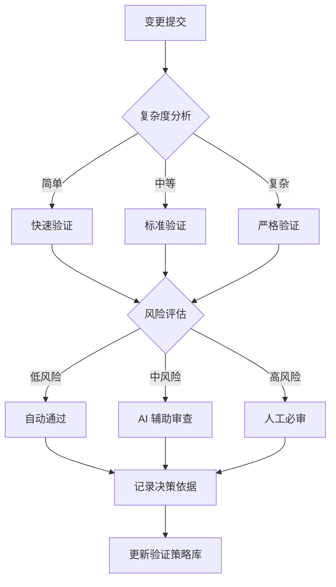

**智能验证规则库**

```typescript
interface AdaptiveValidationRule {
  condition: (change: Change) => boolean;
  checks: ValidationCheck[];
  severity: 'blocking' | 'warning' | 'info';
  learnedFrom: {
    historicalIssues: string[];
    successPatterns: string[];
  };
}

// 示例:学习型规则
const rules: AdaptiveValidationRule[] = [
  {
    condition: (c) => c.impactsAuth && c.complexity === 'high',
    checks: [
      'require_security_review',
      'require_migration_plan',
      'require_rollback_strategy'
    ],
    severity: 'blocking',
    learnedFrom: {
      historicalIssues: ['auth-breach-2024-01', 'migration-failure-2024-02'],
      successPatterns: ['gradual-rollout', 'feature-flag']
    }
  }
];
```

**能力 4: 智能冲突检测与解决**

**当前 SOP**
```
检测到冲突 → 报错 → 用户手动解决
```

**Agentic 方式**

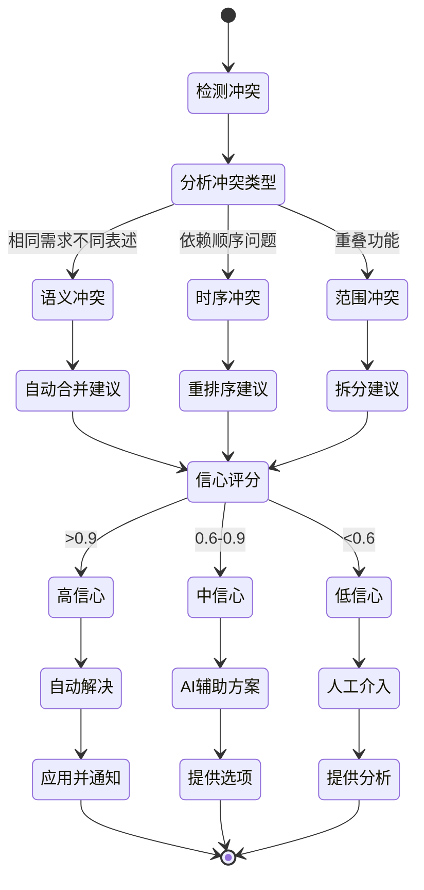

**冲突解决策略库**

| 冲突类型 | 检测方法 | 解决策略 | 自动化程度 |
|---------|---------|---------|----------|
| 同名需求 | 标题匹配 | 合并或重命名建议 | 高(自动提供选项) |
| 依赖循环 | 依赖图分析 | 重新排序或拆分 | 中(需确认) |
| 语义重复 | 向量相似度 | 去重或关联 | 中(需人工验证) |
| 破坏性叠加 | 影响分析 | 分阶段或互斥 | 低(复杂决策) |

### 11.4 学习与优化机制

**经验库设计**

```typescript
interface ExperienceEntry {
  id: string;
  timestamp: Date;
  
  // 上下文快照
  context: {
    changeType: string;
    complexity: string;
    affectedSpecs: string[];
    teamSize: number;
  };
  
  // 决策记录
  decision: {
    workflow: string;
    validationLevel: string;
    toolsUsed: string[];
  };
  
  // 结果反馈
  outcome: {
    success: boolean;
    timeToComplete: number;
    issuesFound: Issue[];
    userSatisfaction?: number;  // 1-5 评分
  };
  
  // 提取的模式
  patterns: {
    successFactors: string[];
    antiPatterns: string[];
  };
}
```

**学习循环**

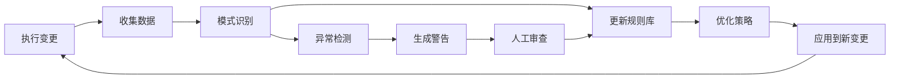

**自动优化示例**

| 观察到的模式 | 学习到的规则 | 优化行动 |
|------------|------------|----------|
| Auth 相关变更常需要 design.md | IF spec=auth THEN suggest_design=true | 自动提示创建设计文档 |
| 小型 UI 变更很少有问题 | IF complexity=simple AND area=UI THEN validation=relaxed | 降低验证门槛 |
| 数据库迁移失败率高 | IF has_migration THEN require_rollback_plan=true | 强制要求回滚计划 |
| 跨 spec 变更需要更长时间 | IF affected_specs.length > 2 THEN estimated_time *= 1.5 | 调整时间估算 |

### 11.5 实现路线图

**阶段 1: 基础智能化(1-2 个月)**

**目标**: 从规则引擎到简单推理

| 功能 | 技术方案 | 交付物 |
|------|---------|--------|
| 意图识别 | 基于关键词的分类器 + 简单 LLM prompt | Intent classifier API |
| 上下文感知 | 文件系统扫描 + 基础解析 | Context provider service |
| 动态模板 | 基于规则的模板选择 | Template engine upgrade |
| 简单学习 | 统计频次,调整默认值 | Experience logger |

**实现示例**

```typescript
// 意图识别器
class IntentRecognizer {
  async recognize(userInput: string, context: Context): Promise<Intent> {
    // 1. 关键词匹配
    const keywords = this.extractKeywords(userInput);
    
    // 2. 上下文分析
    const existingSpecs = await context.listSpecs();
    const activeChanges = await context.listActiveChanges();
    
    // 3. 推理意图
    if (keywords.includes('add') && !this.hasRelatedSpec(keywords, existingSpecs)) {
      return { type: 'new_capability', confidence: 0.8 };
    }
    
    if (keywords.includes('fix') || keywords.includes('bug')) {
      return { type: 'bug_fix', confidence: 0.9 };
    }
    
    // 4. LLM 辅助(不确定时)
    if (confidence < 0.7) {
      return await this.llmClassify(userInput, context);
    }
  }
}

// 动态工作流生成
class WorkflowGenerator {
  generate(intent: Intent, context: Context): Workflow {
    const baseWorkflow = this.getBaseWorkflow(intent.type);
    
    // 基于上下文调整
    if (context.complexity === 'simple') {
      baseWorkflow.steps = baseWorkflow.steps.filter(s => s.required);
    }
    
    if (context.riskLevel === 'high') {
      baseWorkflow.steps.push({
        name: 'security_review',
        required: true,
        blocker: true
      });
    }
    
    return baseWorkflow;
  }
}
```

**阶段 2: 增强推理(3-4 个月)**

**目标**: 多步推理和自主决策

| 功能 | 技术方案 | 交付物 |
|------|---------|--------|
| 复杂度评估 | ML 模型(基于历史数据训练) | Complexity predictor |
| 风险分析 | 依赖图分析 + 影响范围计算 | Risk analyzer |
| 冲突检测 | 语义相似度 + 依赖关系 | Smart conflict detector |
| 自适应验证 | 动态规则引擎 | Adaptive validator |

**实现示例**

```typescript
// 复杂度评估器(基于 ML)
class ComplexityEstimator {
  private model: MLModel;  // 预训练模型
  
  async estimate(change: Change): Promise<ComplexityScore> {
    const features = this.extractFeatures(change);
    /*
    特征包括:
    - 影响的文件数量
    - 新增/修改/删除的行数
    - 影响的 specs 数量
    - 依赖深度
    - 历史相似变更的平均复杂度
    */
    
    const prediction = await this.model.predict(features);
    
    return {
      level: this.mapToLevel(prediction.score),
      confidence: prediction.confidence,
      factors: prediction.topFeatures,
      historicalComparison: this.findSimilarChanges(change)
    };
  }
}

// 智能冲突检测
class SmartConflictDetector {
  async detect(newChange: Change, existingChanges: Change[]): Promise<Conflict[]> {
    const conflicts: Conflict[] = [];
    
    for (const existing of existingChanges) {
      // 1. 结构冲突(传统方式)
      const structuralConflicts = this.detectStructuralConflicts(newChange, existing);
      
      // 2. 语义冲突(AI 辅助)
      const semanticSimilarity = await this.computeSemanticSimilarity(
        newChange.description,
        existing.description
      );
      
      if (semanticSimilarity > 0.8) {
        conflicts.push({
          type: 'semantic_overlap',
          severity: 'medium',
          with: existing.id,
          suggestion: await this.generateMergeSuggestion(newChange, existing)
        });
      }
      
      // 3. 依赖冲突
      const dependencyConflicts = this.analyzeDependencyConflicts(newChange, existing);
      conflicts.push(...dependencyConflicts);
    }
    
    return conflicts;
  }
}
```

**阶段 3: 自主规划(5-6 个月)**

**目标**: 端到端自主完成变更生命周期

| 功能 | 技术方案 | 交付物 |
|------|---------|--------|
| 目标分解 | 层次化任务规划(HTN) | Goal planner |
| 自主执行 | Agent executor with tool use | Autonomous agent |
| 自我监控 | 执行监控 + 异常恢复 | Self-monitoring system |
| 反馈循环 | 强化学习(基于结果优化策略) | RL optimizer |

**Agent 执行引擎**

```typescript
class AutonomousAgent {
  async execute(goal: Goal): Promise<ExecutionResult> {
    // 1. 规划阶段
    const plan = await this.planner.createPlan(goal);
    
    // 2. 执行循环
    const monitor = new ExecutionMonitor(plan);
    
    while (!plan.isComplete()) {
      const nextAction = plan.getNextAction();
      
      try {
        // 执行动作
        const result = await this.executeAction(nextAction);
        
        // 验证结果
        const validation = await this.validateResult(result, nextAction.expectedOutcome);
        
        if (!validation.success) {
          // 自主恢复或重新规划
          const recovery = await this.recoverFromFailure(validation.error, plan);
          
          if (recovery.shouldReplan) {
            plan = await this.planner.replan(goal, recovery.context);
          }
        } else {
          plan.markComplete(nextAction);
        }
        
      } catch (error) {
        // 异常处理
        const decision = await this.handleException(error, plan);
        
        if (decision.escalate) {
          return {
            status: 'needs_human_intervention',
            context: decision.context,
            suggestions: decision.humanActions
          };
        }
      }
    }
    
    // 3. 学习阶段
    await this.learningLayer.recordExperience({
      goal,
      plan,
      outcome: 'success',
      efficiency: monitor.getEfficiencyMetrics()
    });
    
    return { status: 'complete', result: plan.getFinalOutput() };
  }
}
```

### 11.6 Agentic 交互模式

**对话式工作流**

**传统 SOP**
```bash
$ openspec create add-payment
# 用户手动编辑文件...
$ openspec validate add-payment
# 修复错误...
$ openspec archive add-payment
```

**Agentic 交互**
```bash
$ openspec agent "添加支付功能"

🤖 Agent: 我理解你想添加支付功能。让我先分析一下现有系统...

📊 分析结果:
- 检测到现有 payment-processing spec(处理逻辑)
- 未发现 payment-gateway spec(网关集成)
- 代码库使用 Stripe API
- 3 个活跃变更,无冲突

🎯 建议方案:
方案 A: 扩展现有 payment-processing spec
  - 复杂度: 中等
  - 预估时间: 2-3 天
  - 风险: 低
  
方案 B: 新建 payment-gateway spec  
  - 复杂度: 高
  - 预估时间: 5-7 天
  - 风险: 中等(需要架构设计)

请选择方案(A/B)或描述你的需求: B

🤖 Agent: 好的,我将创建新的 payment-gateway capability。
由于这是高复杂度变更,我建议:
✓ 创建 design.md(架构决策)
✓ 使用 strict 验证模式
✓ 分阶段实现(3 个 milestone)

是否继续? (y/n): y

⚙️ Agent: 正在执行...
✓ 创建 changes/add-payment-gateway/
✓ 生成 proposal.md(基于代码分析)
✓ 生成 tasks.md(分解为 12 个任务)
✓ 生成 design.md 模板(检测到需要集成外部 API)
✓ 生成 specs/payment-gateway/spec.md
✓ 运行验证...全部通过

📝 下一步建议:
1. 审查 proposal.md 并调整
2. 团队评审 design.md
3. 运行 `openspec agent implement add-payment-gateway` 开始实现

需要我做什么吗?
```

**多轮对话式细化**

```
User: 实际上,我只需要支持支付宝,不需要 Stripe

🤖 Agent: 明白了。让我更新方案...

📊 影响分析:
- 修改 design.md 中的技术选型
- 调整 tasks.md 中的集成步骤  
- 更新 spec.md 中的 API 场景

✓ 已更新所有相关文件
✓ 重新验证...通过

变更摘要:
- 移除 Stripe 相关任务(原 task 2.1-2.3)
- 添加支付宝 SDK 集成(新 task 2.1-2.4)
- 更新安全审查要求(支付宝特定)

User: 很好,开始实现吧

🤖 Agent: 开始实现 add-payment-gateway...

[Progress Bar] Task 1.1/12: 安装支付宝 SDK
✓ 完成(2分钟)

[Progress Bar] Task 1.2/12: 配置环境变量
⚠️ 警告:检测到 .env 文件缺少必需的配置

建议行动:
1. 添加 ALIPAY_APP_ID
2. 添加 ALIPAY_PRIVATE_KEY
3. 添加 ALIPAY_PUBLIC_KEY

我可以生成模板配置文件,需要吗?(y/n): y

✓ 已创建 .env.example
⏸️ 暂停,等待你填写真实密钥后继续...

(输入 'continue' 继续)
```

### 11.7 关键技术栈

**AI/ML 组件**

| 组件 | 技术选型 | 用途 |
|------|---------|------|
| LLM 推理 | OpenAI API / Anthropic Claude | 意图识别、冲突解决建议 |
| 向量数据库 | Pinecone / Weaviate | 语义搜索、相似变更检索 |
| 嵌入模型 | OpenAI Embeddings / sentence-transformers | 文本向量化 |
| 轻量 ML | scikit-learn / TensorFlow.js | 复杂度预测、模式识别 |
| 规则引擎 | json-rules-engine | 可解释的决策逻辑 |

**Agent 框架**

| 框架 | 优势 | 适用场景 |
|------|------|----------|
| LangChain | 丰富的工具生态 | 快速原型,链式推理 |
| AutoGen | 多 Agent 协作 | 复杂任务分解 |
| Semantic Kernel | Microsoft 生态集成 | 企业环境 |
| Custom Agent | 完全控制 | 特定领域优化 |

**推荐架构(渐进式)**

```typescript
// 阶段 1: 混合方式(规则 + LLM)
class HybridAgent {
  private ruleEngine: RulesEngine;
  private llm: LLMClient;
  
  async decide(context: Context): Promise<Decision> {
    // 1. 尝试规则引擎(快速、可解释)
    const ruleDecision = await this.ruleEngine.evaluate(context);
    
    if (ruleDecision.confidence > 0.9) {
      return ruleDecision;  // 高信心,直接使用
    }
    
    // 2. 规则不确定,咨询 LLM
    const llmDecision = await this.llm.reason({
      context,
      priorRuleResult: ruleDecision,
      constraints: this.getConstraints()
    });
    
    // 3. 合并决策
    return this.mergeDecisions(ruleDecision, llmDecision);
  }
}

// 阶段 2: Agent 编排
class AgentOrchestrator {
  private agents: {
    analyzer: AnalyzerAgent;      // 分析上下文
    planner: PlannerAgent;        // 生成计划
    executor: ExecutorAgent;      // 执行动作
    validator: ValidatorAgent;    // 验证结果
    learner: LearnerAgent;        // 学习优化
  };
  
  async run(userGoal: string): Promise<Result> {
    // 1. 分析阶段
    const analysis = await this.agents.analyzer.analyze(userGoal);
    
    // 2. 规划阶段
    const plan = await this.agents.planner.plan(analysis);
    
    // 3. 执行阶段
    const execution = await this.agents.executor.execute(plan);
    
    // 4. 验证阶段
    const validation = await this.agents.validator.validate(execution);
    
    // 5. 学习阶段
    await this.agents.learner.learn({
      input: userGoal,
      analysis,
      plan,
      execution,
      validation
    });
    
    return validation.result;
  }
}
```

### 11.8 度量与评估

**Agentic 系统成功指标**

| 指标类别 | 具体指标 | 目标值 | 测量方法 |
|---------|---------|--------|----------|
| 自主性 | 无需人工干预的变更比例 | >60% | 完全自动完成 / 总变更 |
| 准确性 | 意图识别准确率 | >90% | 正确识别 / 总识别 |
| 效率 | 平均变更创建时间 | <2分钟 | 从输入到验证通过 |
| 适应性 | 动态调整成功率 | >80% | 成功调整 / 需要调整 |
| 学习能力 | 重复问题减少率 | -20%/月 | 本月问题 / 上月问题 |
| 用户满意度 | Agent 推荐接受率 | >75% | 采纳建议 / 总建议 |

**A/B 测试框架**

```typescript
interface ABTestConfig {
  controlGroup: 'sop';      // 传统 SOP 流程
  treatmentGroup: 'agentic'; // Agentic 流程
  metrics: [
    'time_to_create',
    'validation_errors',
    'user_satisfaction',
    'completion_rate'
  ];
  duration: '30_days';
}

// 对比报告示例
/*
结果:
SOP 组:
- 平均创建时间: 15 分钟
- 验证错误率: 25%
- 完成率: 70%
- 满意度: 3.2/5

Agentic 组:
- 平均创建时间: 3 分钟
- 验证错误率: 8%
- 完成率: 85%
- 满意度: 4.1/5

统计显著性: p < 0.01
建议:全面推广 Agentic 模式
*/
```

### 11.9 风险与挑战

**技术风险**

| 风险 | 影响 | 缓解策略 |
|------|------|----------|
| LLM 幻觉导致错误决策 | 高 | 混合决策(规则+AI),关键步骤人工确认 |
| 成本过高(API 调用) | 中 | 缓存、本地模型、渐进式启用 |
| 复杂性增加,难以调试 | 中 | 详细日志、决策可解释性、降级机制 |
| 过度依赖,人工技能退化 | 低 | 保留手动模式,定期审查 |

**实施策略**

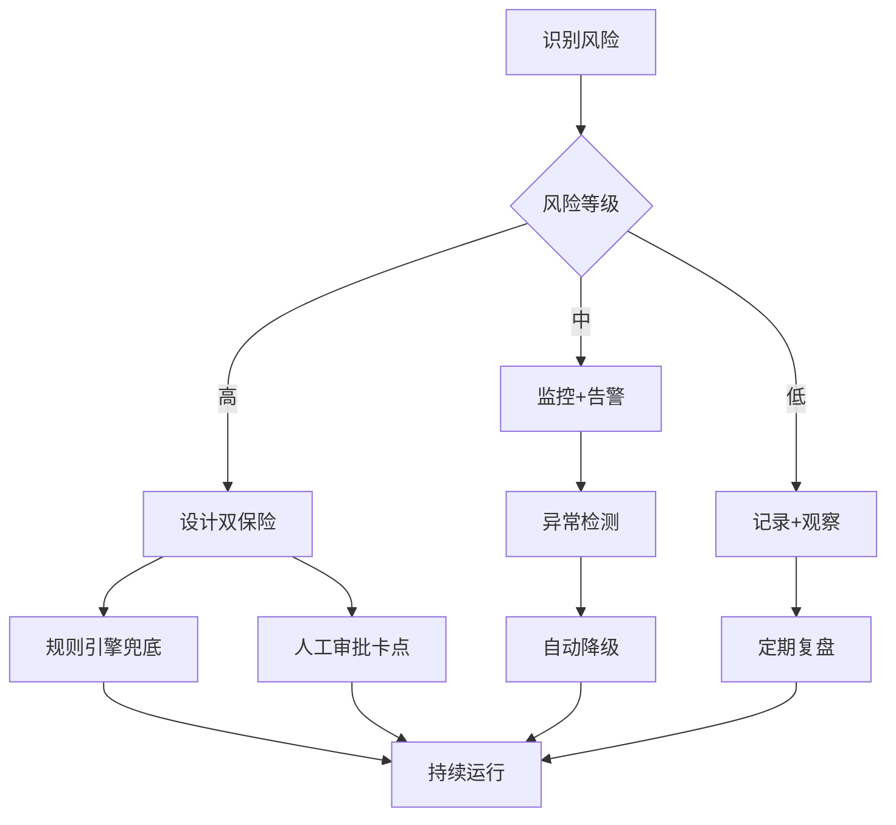

### 11.10 实战案例:Agentic OpenSpec 演示

**场景**: 用户想添加 "两步验证" 功能

**传统 SOP 流程(10 步,20 分钟)**

```
1. 用户决定是否需要 proposal
2. 运行 openspec create add-2fa
3. 手动编写 proposal.md
4. 手动创建 specs/auth/spec.md
5. 决定使用 ADDED 还是 MODIFIED
6. 编写 delta 内容
7. 手动创建 tasks.md
8. 运行 openspec validate
9. 修复格式错误
10. 重新验证
```

**Agentic 流程(交互式,3 分钟)**

```bash
$ openspec agent "添加两步验证"

🤖 分析中...
✓ 检测到现有 specs/auth/ 
✓ 发现代码库已有 User 模型
✓ 识别为扩展现有能力

🎯 我的理解:
- 在现有认证系统上添加 2FA
- 需要修改 auth spec(MODIFIED + ADDED)
- 需要数据库迁移(users 表新增字段)
- 中等复杂度,建议创建 design.md

是否正确?(y/n/调整): y

⚙️ 自动生成中...
✓ 创建 changes/add-2fa/
✓ 分析代码生成 proposal.md
✓ 检测到 Prisma,生成迁移任务
✓ 生成 tasks.md(12 个任务,分 3 个阶段)
✓ 生成 design.md(包含安全考虑)
✓ 生成 specs/auth/spec.md delta
  - MODIFIED "User Authentication"(添加 2FA 要求)
  - ADDED "Two-Factor Setup"(新需求)
  - ADDED "OTP Verification"(新需求)
✓ 验证通过

📊 预估:
- 实现时间: 3-4 天
- 风险等级: 中(涉及安全)
- 建议:security review before merge

✅ 完成!查看 changes/add-2fa/

下一步:
1. 审查生成的内容
2. 调整任务优先级
3. 运行 `openspec agent implement add-2fa` 开始实现
```

**对比总结**

| 维度 | SOP | Agentic | 提升 |
|------|-----|---------|------|
| 时间 | 20 分钟 | 3 分钟 | 6.7x |
| 人工步骤 | 10 | 2(确认) | 5x |
| 错误率 | ~30% | ~5% | 6x |
| 认知负担 | 高(需要记住格式) | 低(对话式) | - |
| 质量 | 依赖人工 | AI 辅助,更全面 | + |

### 11.11 开源与社区

**开放 Agentic 能力**

```typescript
// 插件化 Agent 能力
interface AgentPlugin {
  name: string;
  version: string;
  
  capabilities: {
    intentRecognition?: IntentRecognizer;
    contextAnalysis?: ContextAnalyzer;
    planGeneration?: PlanGenerator;
    conflictResolution?: ConflictResolver;
  };
  
  // 允许社区贡献自定义能力
  register(registry: AgentRegistry): void;
}

// 示例:社区贡献的领域特定 Agent
class EcommerceAgent implements AgentPlugin {
  name = 'ecommerce-agent';
  
  capabilities = {
    intentRecognition: new EcommerceIntentRecognizer(),
    // 识别 "添加购物车"、"支付流程" 等电商特定意图
  };
}
```

**经验共享机制**

```markdown
## 社区经验库

每个团队的 Agent 可以选择性共享:
- 成功的变更模式
- 领域特定规则
- 最佳实践模板

隐私保护:
- 仅共享元数据和模式
- 不包含敏感代码或业务逻辑
- 可选的匿名化
```

### 11.12 总结:从 SOP 到 Agentic 的价值

**核心转变**

| 方面 | SOP 思维 | Agentic 思维 |
|------|---------|-------------|
| 系统角色 | 工具(被动) | 助手(主动) |
| 用户角色 | 操作者 | 决策者 |
| 交互方式 | 命令式 | 对话式 |
| 工作流 | 固定流程 | 动态适配 |
| 错误处理 | 报错中断 | 智能恢复 |
| 学习能力 | 静态 | 持续优化 |
| 价值定位 | 提高一致性 | 提高生产力+质量 |

**渐进式采用建议**

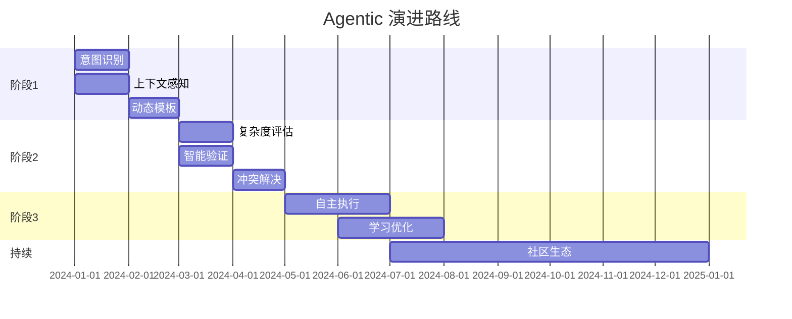

**最终愿景**

> OpenSpec 从一个规范管理工具,演进为一个智能协作伙伴:
> - 理解你的意图,而非等待命令
> - 主动发现问题,而非被动报错  
> - 从历史学习,而非重复错误
> - 适应团队习惯,而非强制流程
>
> 让开发者聚焦创造,让 Agent 处理繁琐。
